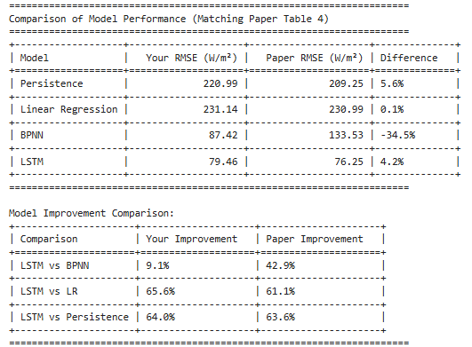

# 🌍 AI for Global Challenges – Assignment 1  

This repository contains coursework for the **AI for Global Challenges** module (MSc Artificial Intelligence and Sustainable Development, University of Birmingham).  

The task was to **replicate and critically assess** a published AI study linked to sustainable development — specifically applying machine learning to renewable energy forecasting.  
It combines **technical replication** (training models, reproducing results) with a **critical evaluation** of performance and limitations.  

---

## 📖 Project Overview  

- Implemented and evaluated three models: **Linear Regression, BP Neural Network (BPNN), and LSTM**.  
- Compared model accuracy (RMSE) against results reported in the original paper.  
- Analyzed performance differences and discussed implications for **sustainable development goals (SDGs)**.  

---

## ✨ Features  

- **Jupyter Notebooks (`.ipynb`)** with end-to-end workflow.  
- **Model training and evaluation** using scikit-learn and Python ML libraries.  
- **Result replication**: comparison of reproduced results with published benchmarks.  
- **Critical reflection** on model accuracy, limitations, and sustainability context.  

---

## 🛠 Tech Stack  

- **Python 3**  
- **Jupyter Notebook**  
- Libraries: `scikit-learn`, `pandas`, `numpy`, `matplotlib`, `seaborn`  

---

## 📂 Repository Structure

- `Assignment 1.ipynb` — Coursework notebook  
- `train_NREL_solar_data.csv` — Training dataset  
- `test_NREL_solar_data.csv` — Test dataset  
- `validate_NREL_solar_data.csv` — Validation dataset  
- `Table_Replication.png` — Results figure (replicated paper table)  
- `README.md` — Project documentation


---

## 📊 Results: Replication of Paper Table

The following figure shows the replicated results compared to the published paper’s benchmarks:



*Figure: Comparison of reproduced RMSE values and improvements across models.*

---

## 🚀 Setup Instructions

Clone the repo:

```bash
git clone https://github.com/Moqo12/AI-for-Global-Challenges.git
cd AI-for-Global-Challenges

Create and activate a virtual environment (recommended):
python -m venv venv
source venv/bin/activate   # On Windows: venv\Scripts\activate

Run the notebooks in Jupyter:
jupyter notebook
```

---
## 📌 About
This project was completed as part of the MSc Artificial Intelligence and Sustainable Development at the University of Birmingham.
It showcases skills in:
- Training and evaluating machine learning models (LR, BPNN, LSTM)
- Using Python ML libraries in reproducible research
- Replicating and validating published AI research
- Critically reflecting on model performance and implications for sustainability


